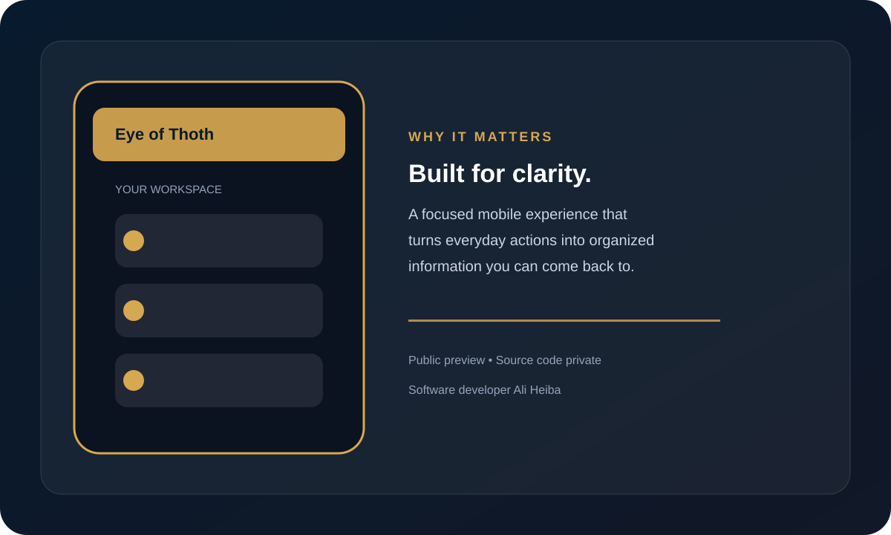

# Eye of Thoth

**منصة ذكية لاستكشاف النقوش والقطع الأثرية وتحويل الصورة إلى معرفة قابلة للفهم.**

## فكرة المشروع

يقدم **Eye of Thoth** تجربة رقمية موجهة للباحثين والمهتمين بالتاريخ والتراث، تساعد على تصوير النقوش أو القطع الأثرية والاحتفاظ بسجل منظم للتحليلات والنتائج. صُمم المشروع ليكون نقطة بداية عملية لفهم المادة المصوّرة، توثيقها، والعودة إليها لاحقًا.

## ماذا يقدم للمستخدم؟

- التقاط صورة للنقش أو القطعة الأثرية من داخل التطبيق.
- تنظيم عمليات الفحص والنتائج في سجل تاريخي.
- عرض النتائج في واجهة واضحة وسهلة الاستخدام.
- حفظ التقارير والملاحظات المرتبطة بكل عملية تحليل.
- تجربة مناسبة للاستكشاف الأولي والتعليم والتوثيق الشخصي.

> نتائج التطبيق أداة مساعدة للاستكشاف والتوثيق، ولا تُعد بديلًا عن التحقق الأكاديمي أو رأي المتخصصين في علم الآثار واللغات القديمة.

## الإصدار المتاح

هذا المستودع مخصص للعرض وتحميل نسخة Android الجاهزة. **الكود المصدري محفوظ في مستودع خاص وغير منشور للعامة.**

- الإصدار: `1.0.0`
- المنصة: Android
- [تحميل APK](../../Eye-of-Thoth-Public/releases/tag/v1.0.0)

## Screenshots

### Project overview

### Experience preview

> هذه الصور معاينات مرئية تعريفية للنسخة العامة، بينما يظل الكود المصدري محفوظًا في مستودع خاص.

## المطور

**Software developer Ali Heiba**

## الخصوصية والأمان

يُرجى مراجعة أذونات الجهاز قبل الاستخدام، وعدم مشاركة الصور أو التقارير الحساسة إلا مع الجهات الموثوقة. استخدم التطبيق وفق القوانين واللوائح المحلية المتعلقة بتصوير وتوثيق الآثار.
